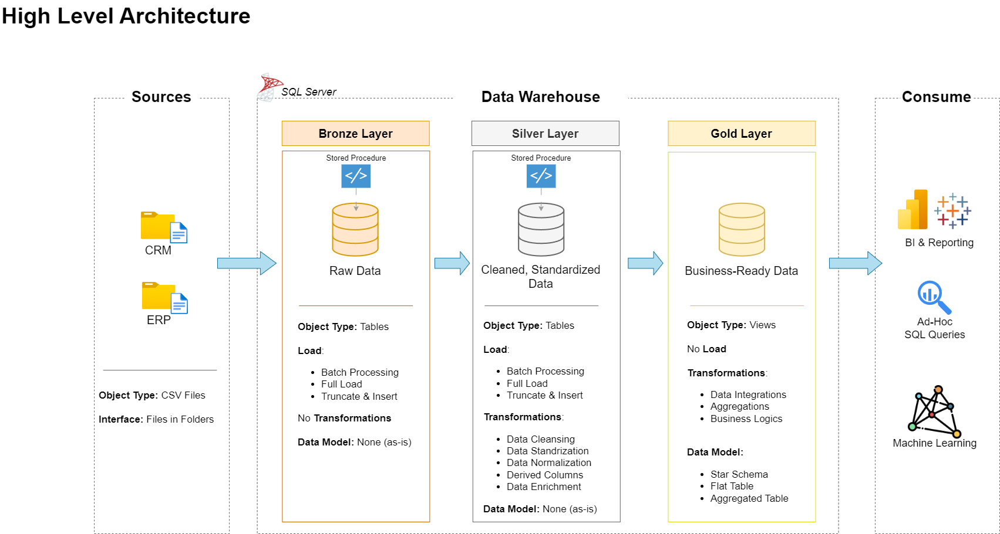

# My MS SQL Data Warehouse Project and Analysis
Hello to all who read this! This project demonstrates a comprehensive data warehousing and analytics solution, from building a data warehouse to generating actionable insights. 

---
## 📚 Project Overview
Since this is designed as a portfolio project, it highlights industry’s best practices in data engineering and analytics. The project involves:
* Data Architecture: Design a Data Warehouse using the medallion method (Bronze, Silver, and Gold layers).
* ETL Pipelines: Extraction, transformation and loading of data from a source system into our warehouse.
* Data Modeling: Develop a fact and dimension tables to optimize analytical queries
* Analytics & Reporting: Creating SQL based reports for actionable insights.

## 💡 Alternatives Database Systems
This portfolio project was based off using Microsoft SQL Server since it is a common industry standard. I will also be implementing in PostgreSQL, MariaDB, MySQL and Google BigQuery to showcase my adaptation of other database technologies.

## 🦺 Project Expansion
While not part of the original project. I thought of a AI powered chat interface that could query the data and action results using NLP and a simple chat interface. More to come...

---
## 🏗️ Data Architecture
The data architecture for this project follows Medallion Architecture Bronze, Silver, and Gold layers:

* 🥉 **Bronze Layer**: Stores raw data as-is from the source systems. Data is ingested from CSV Files into SQL Server Database.
* 🥈 **Silver Layer**: This layer includes data cleansing, standardization, and normalization processes to prepare data for analysis.
* 🥇 **Gold Layer**: Houses business-ready data modeled into a star schema required for reporting and analytics.
---
## 📋 Project Requirements
### Building the Data Warehouse (Data Engineering)
#### Objective
* Develop a modern data warehouse using SQL Server to consolidate sales data, enabling analytical reporting and informed decision-making.

#### Specifications
* **Data Sources**: Import data from two source systems (ERP and CRM) provided as CSV files.
* **Data Quality**: Cleanse and resolve data quality issues prior to analysis.
* **Integration**: Combine both sources into a single, user-friendly data model designed for analytical queries.
* **Scope**: Focus on the latest dataset only; historization of data is not required.
* **Documentation**: Provide clear documentation of the data model to support both business stakeholders and analytics teams.

### BI: Analytics & Reporting (Data Analysis)
#### Objective

* Develop SQL-based analytics to deliver detailed insights into:
    1. Customer Behavior
    2. Product Performance
    3. Sales Trends

These insights empower stakeholders with key business metrics, enabling strategic decision-making.

Additional requirements, naming conventions and tables descriptions with details will be listed in the [docs folder](docs) of this project.

---

This project was created by [Data with Baraa](https://www.youtube.com/@DataWithBaraa). It was a wonderful project, and I learned a considerable amount. In my professional life I have done projects like this, but it was something that I was never formally trained in. My background is more Infrastructure Technology Specialist than Data focused. This project has encouraged me to do more projects related to data analysis/engineering. All credit should go to him. A link to [this project](https://github.com/DataWithBaraa/sql-data-warehouse-project) and his [Github](https://github.com/DataWithBaraa) are here.
